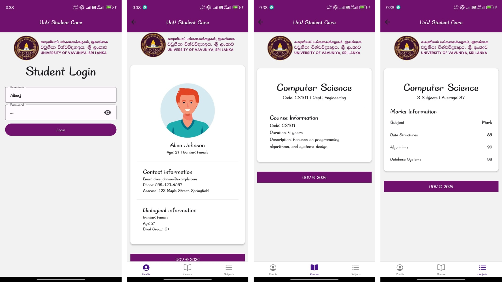

# UoV Student Care App

## Description
The **UoV Student Care App** is a React Native application designed for managing and viewing student information. This app includes features such as user login, viewing student profiles, course details, and subject details. It utilizes React Native Navigation and React Native Paper, among other dependencies, to create a seamless and user-friendly experience.

## Features
- **Login Page**: Secure login functionality for students.
- **Student Profile**: Displays details of the logged-in student.
- **Course Details**: Provides information about the courses enrolled.
- **Subject Details**: Shows detailed information about the subjects in each course and marks.

## Dependencies

- **React Native**: Framework for building native apps using React.
- **React Navigation**: Navigation library for routing and navigation.
- **React Native Paper**: UI components for consistent design.
- **Other Dependencies**: Check the `package.json` file for a complete list.

## Screenshots

